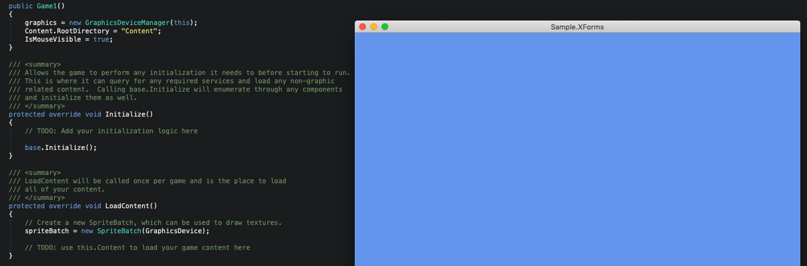
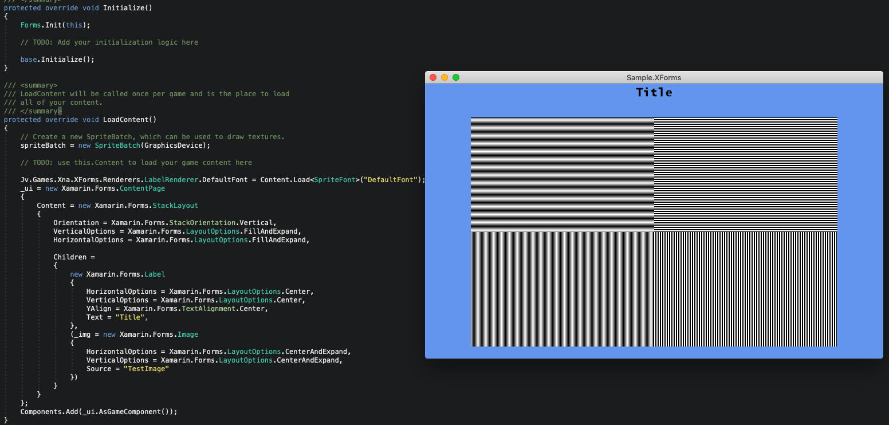

# JV.Games.XNA

## What is this project?

This project aims to provide base classes and helpers to create simple games.

It is structured to help in 3 main areas:
 - Describe and position UI elements (with xamarin-forms)
 - Support for Async / Await
 - Sprites / Animations creation

## Describe and position UI elements (with xamarin-forms)

Support for using Xamarin.Forms layout elements to create your game UI / layout overlays.

It allows you to create a Xamarin Forms VisualElement and convert it into an XNA IGameComponent.

Giving you support for using Xamarin.Forms Grid / Stack / Image / Label / Button / ContentPage, etc.

It also supports using custom renderers in case you need it.

Before:

After:

See Sample.XForms

An initial version of this project was used in conjunction with DioMuller, and this is the xaml for this XNA game's title screen:
https://github.com/DioMuller/ai-enemies/blob/master/src/Enemies/Enemies.Shared/GUI/ScreenTitleMain.xaml

## Support for Async / Await

Games are usually composed of many async operations that are overlooked,
and by async I do NOT mean threads / background execution, but:

Operations that start now, and will finish eventuallly, for example:

Game screens / levels
- they open (start),
- have its logic,
- and eventually complete, with a result or not

Character operations, like chasing other character for example:
- they start the chase
- will keep on trying to reach their target for many game frames
- eventually they will reach their target or get lost

And C# Tasks are great for representing this operations,
they allow you to create reusable / composable methods, without
getting lost in callbacks.

The projects that help on this area are:
- Jv.Games.Context
- Jv.Games.Async
- Jv.Games.Activities

### Jv.Games.Context

Base representation of game operations, their state and result.

### Jv.Games.Async

Adds async/await support on game operations.
Context extensions so they interact with Tasks easily.
Support for runing on old .Net Frameworks with a custom async bridge implementation.

### Jv.Games.Activities

Async representation of a game scren into a Microsoft.Xna.Framework.IGameComponent,
so it integrates easiy with XNA and can be added / removed during execution.
Allows your game screen to have a result, and use an async method to describe
what happens next.

## Sprites / Animations creation

Support for loading a spritesheet or a set of images and describing your character animations.

## My view on this project

This is an old project that I enjoyed playing with in the past.

I would need to revisit and modernize this, with .Net Standard and newer Xamarin.Forms implementations.

I would also like to rewrite the sprites project, and allow loading sprites from json files / directory structures.

I don't plan on doing those soon, since I don't have as much free time as I need.

This project was receiving random github stars, so I did a git-clone of this project and it does run without any dependencies, so I created this README to show this project some love.

I do plan however to add more sample projects, since I had more of those, if I find them somewhere.

I hope it helps inspire you.
